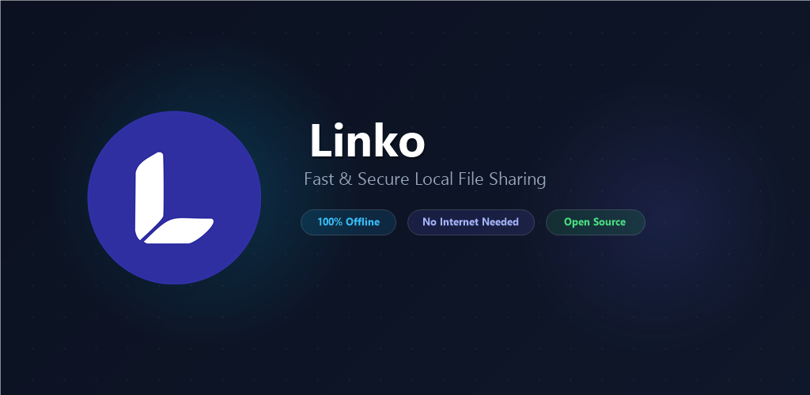
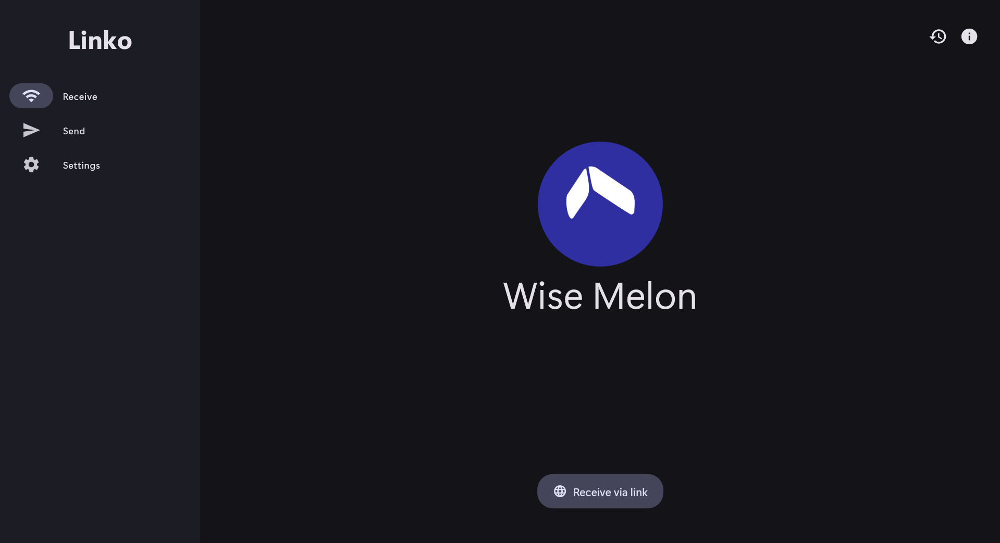
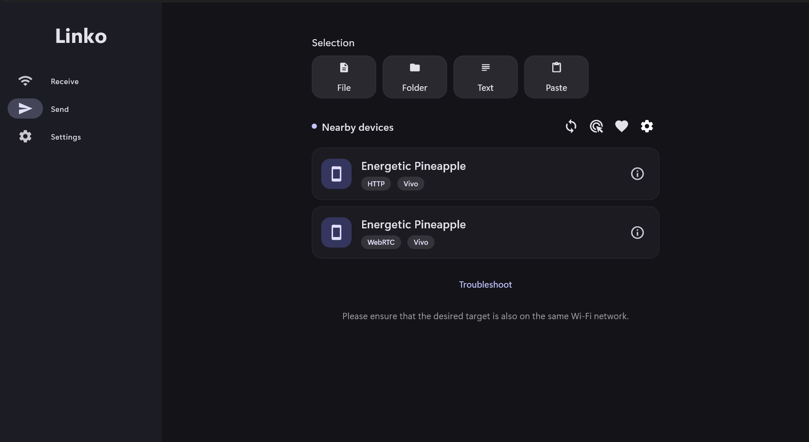
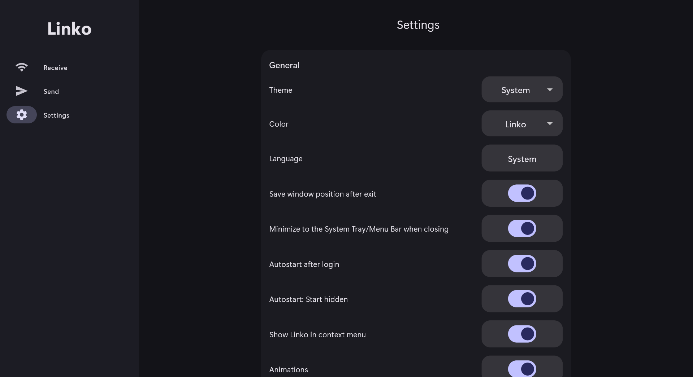
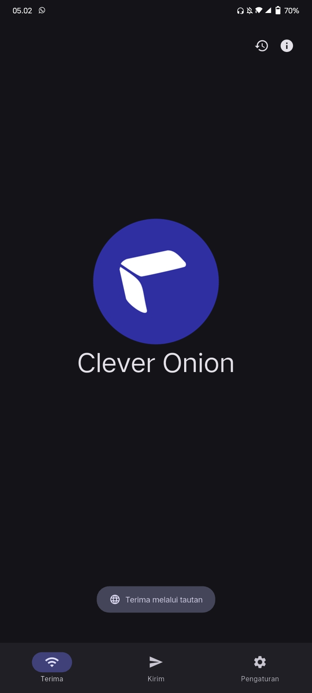
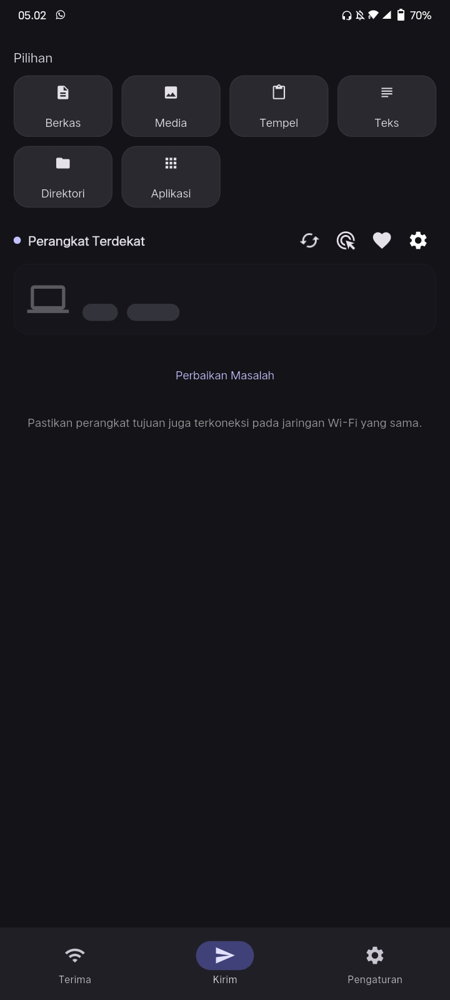
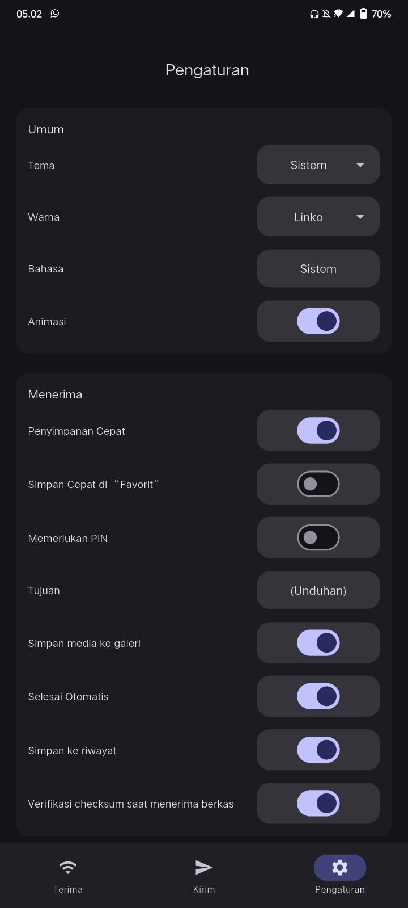

<p align="center">
  
</p>

<p align="center">
  <a href="https://github.com/saferill/Linko/releases/latest"></a>
  <a href="LICENSE"></a>
  
</p>

---

Linko lets you send photos, videos, docs, and text directly to nearby devices on the same Wi-Fi network. It works completely offline without uploading anything to the cloud or using your mobile data.

## Features

- **Direct transfer**: Sends files directly over your local network at full Wi-Fi speed.
- **No internet required**: Works offline, even on portable mobile hotspots.
- **Cross-platform**: Share between Android phones and Windows PC.
- **Encrypted**: Transfers are protected with direct TLS encryption.
- **Clean**: No ads, no tracking, no account needed.

---

## Screenshots

### Windows

<p align="center">
  
  
  
</p>

### Android

<p align="center">
  
  
  
</p>

---

## Downloads

Download the latest version from [GitHub Releases](https://github.com/saferill/Linko/releases/latest):

### Windows
- **Installer**: `Linko-v1.0.0-Windows-x64-Setup.exe`
- **Portable**: `Linko-v1.0.0-Windows-x64-Portable.zip`

### Android
- **Standard (ARM64)**: `Linko-v1.0.0-arm64-v8a-Release.apk` *(recommended for most phones)*
- **Old Devices (ARMv7)**: `Linko-v1.0.0-armeabi-v7a-Release.apk`
- **Emulator / PC (x86_64)**: `Linko-v1.0.0-x86_64-Release.apk`
- **FOSS Edition**: `Linko-v1.0.0-FOSS-arm64-Release.apk`

---

## Building from source

### Requirements
- Flutter SDK (3.x+)
- Rust toolchain (`cargo`)

### Setup & Run
```bash
# Clone repository
git clone https://github.com/saferill/Linko.git
cd Linko/app

# Install dependencies and generate code
flutter pub get
dart run build_runner build
dart run slang

# Run app
flutter run
```

---

## License

[Apache License 2.0](LICENSE)
